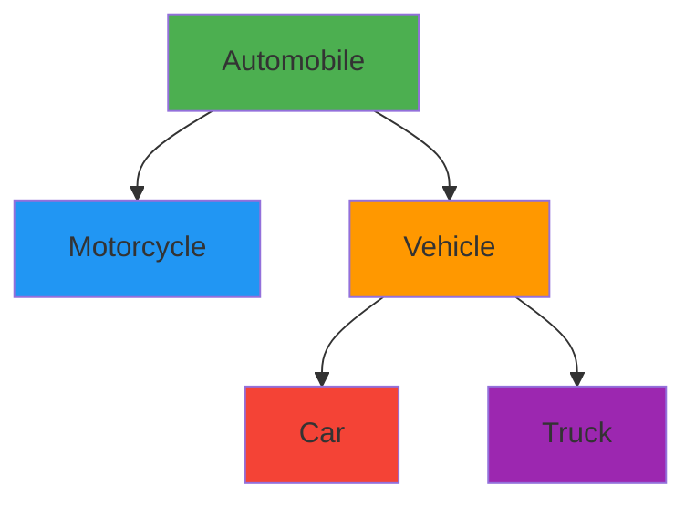

# 🚗 Vehicle Management System

<div align="center">


A comprehensive Dart-based Object-Oriented Programming system for managing different types of vehicles with full CRUD operations, search functionality, and data persistence.

[📖 Documentation](#-overview) • [🚀 Getting Started](#-installation--usage) • [💡 Examples](#-examples)

</div>

## 📋 Table of Contents
<nav>
  <ul>
    <li><a href="#overview">Overview</a></li>
    <li><a href="#features">Features</a></li>
    <li><a href="#project-structure">Project Structure</a></li>
    <li><a href="#class-hierarchy">Class Hierarchy</a></li>
    <li><a href="#installation--usage">Installation & Usage</a></li>
    <li><a href="#api-documentation">API Documentation</a></li>
    <li><a href="#examples">Examples</a></li>
  </ul>
</nav>
<div id="overview">
## 🌟 Overview
</div>

This project implements a complete vehicle management system using Dart's Object-Oriented Programming features. It demonstrates inheritance, encapsulation, polymorphism, and data persistence through a hierarchical class structure for different vehicle types.

<div align="center">
  
</div>


<div id="features">
## ✨ Features
</div>

<table>
  <tr>
    <td align="center">
      <strong>🏗️ OOP Implementation</strong><br>
      Inheritance, encapsulation, polymorphism
    </td>
    <td align="center">
      <strong>🚘 Multiple Vehicle Types</strong><br>
      Cars, Motorcycles, Trucks
    </td>
  </tr>
  <tr>
    <td align="center">
      <strong>🔍 Advanced Search</strong><br>
      By manufacturer, date, plate number
    </td>
    <td align="center">
      <strong>💾 Data Persistence</strong><br>
      JSON serialization/deserialization
    </td>
  </tr>
  <tr>
    <td align="center">
      <strong>🛠️ CRUD Operations</strong><br>
      Create, Read, Update, Delete
    </td>
    <td align="center">
      <strong>📱 Console Interface</strong><br>
      Easy-to-use command-line interface
    </td>
  </tr>
</table>

<div id="project-structure">
## 📁 Project Structure
</div>


```bash
dart_tool/
├── bin/                           # Executable directory
├── lib/                           # Library directory
│   ├── util/
│   │   ├── Enums.dart            # FuelType and GearType enumerations
│   ├── classes/                   # All class definitions
│   │   ├── Engine.dart           # Core engine component
│   │   ├── Automobile.dart       # Base class for all vehicles
│   │   ├── Vehicle.dart          # Intermediate class for land vehicles
│   │   ├── Motorcycle.dart       # Motorcycle-specific implementation
│   │   ├── Car.dart              # Car-specific implementation
│   │   ├── Truck.dart            # Truck-specific implementation
│   ├── VehicleManagementSystem.dart # Main management logic
│   └── task_1.dart               # Application entry point
```

### File Descriptions

| File | Description |
|------|-------------|
| **`Enums.dart`** | Defines `FuelType` and `GearType` enumerations |
| **`Engine.dart`** | Core engine component with specifications |
| **`Automobile.dart`** | Base class for all vehicles |
| **`Vehicle.dart`** | Intermediate class for land vehicles |
| **`Motorcycle.dart`** | Motorcycle-specific implementation |
| **`Car.dart`** | Car-specific implementation |
| **`Truck.dart`** | Truck-specific implementation |
| **`VehicleManagementSystem.dart`** | Main management logic and operations |
| **`task_1.dart`** | Application entry point and testing |

<div id="class_hirerachy">
## 🏗️ Class Hierarchy
</div>


<div align="center">



</div>

### Class Relationships

<table>
  <thead>
    <tr>
      <th>Class</th>
      <th>Parent</th>
      <th>Key Properties</th>
    </tr>
  </thead>
  <tbody>
    <tr>
      <td><strong>Engine</strong></td>
      <td>-</td>
      <td>manufacturer, capacity, fuelType</td>
    </tr>
    <tr>
      <td><strong>Automobile</strong></td>
      <td>-</td>
      <td>company, model, engine, plateNumber</td>
    </tr>
    <tr>
      <td><strong>Motorcycle</strong></td>
      <td>Automobile</td>
      <td>tierDiameter, length</td>
    </tr>
    <tr>
      <td><strong>Vehicle</strong></td>
      <td>Automobile</td>
      <td>length, width, color</td>
    </tr>
    <tr>
      <td><strong>Car</strong></td>
      <td>Vehicle</td>
      <td>chairNumber, isFurnitureLeather</td>
    </tr>
    <tr>
      <td><strong>Truck</strong></td>
      <td>Vehicle</td>
      <td>freeWeight, fullWeight</td>
    </tr>
  </tbody>
</table>

## 🚀 Installation & Usage

### Prerequisites
- **Dart SDK**: Version 3.7.0 or higher
- **Git**: For version control
<div id="installation--usage">
### Installation  
</div>


```bash
# Clone the repository
git clone https://github.com/EmadAbuAmer/Dart_Task.git

# Navigate to project directory
cd task_1

# Run the application
dart run lib/task_1.dart
```

### Running Tests

```bash
# Run the main application with sample data
dart run lib/task_1.dart

# Or compile and run
dart compile exe lib/task_1.dart -o bin/vehicle_manager
./bin/vehicle_manager
```
<div id="api-documentation">
## 📚 API Documentation
</div>


### Core Classes

#### Engine Class
```dart
final engine = Engine.parameterizedEngine(
  'Toyota', 
  DateTime(2022, 1, 1), 
  'V6', 
  3000, 
  6, 
  FuelType.gasoline
);
```

#### Vehicle Management
```dart
final vms = VehicleManagementSystem();

// Add vehicles
vms.addCar(car);
vms.addMotorcycle(motorcycle);
vms.addTruck(truck);

// Search operations
vms.searchByManufacturer('Toyota');
vms.searchByPlateNumber(1234);
vms.searchByManufactureDate(DateTime(2022, 1, 1));

// Data persistence
vms.saveToFile('vehicles.json');
vms.loadFromFile('vehicles.json');
```

### Key Methods

<table>
  <thead>
    <tr>
      <th>Method</th>
      <th>Description</th>
      <th>Parameters</th>
    </tr>
  </thead>
  <tbody>
    <tr>
      <td><code>addVehicle()</code></td>
      <td>Add new vehicle</td>
      <td>Vehicle object</td>
    </tr>
    <tr>
      <td><code>searchByManufacturer()</code></td>
      <td>Search by company</td>
      <td>String manufacturer</td>
    </tr>
    <tr>
      <td><code>searchByPlateNumber()</code></td>
      <td>Search by plate</td>
      <td>int plateNumber</td>
    </tr>
    <tr>
      <td><code>saveToFile()</code></td>
      <td>Save to JSON</td>
      <td>String filename</td>
    </tr>
    <tr>
      <td><code>loadFromFile()</code></td>
      <td>Load from JSON</td>
      <td>String filename</td>
    </tr>
    <tr>
      <td><code>printAll()</code></td>
      <td>Display all vehicles</td>
      <td>-</td>
    </tr>
  </tbody>
</table>

## 🎯 OOP Principles Implemented

<div class="principles-grid">
  <div class="principle-card">
    <h3>🔒 Encapsulation</h3>
    <ul>
      <li>All fields are private (prefixed with <code>_</code>)</li>
      <li>Controlled access via getter/setter methods</li>
      <li>Data validation in setters</li>
    </ul>
  </div>
  
  <div class="principle-card">
    <h3>🧬 Inheritance</h3>
    <ul>
      <li>Hierarchical class structure</li>
      <li>Code reuse through parent classes</li>
      <li>Method overriding in child classes</li>
    </ul>
  </div>
  
  <div class="principle-card">
    <h3>🔄 Polymorphism</h3>
    <ul>
      <li>Overridden <code>toString()</code> methods</li>
      <li>Custom JSON serialization per class</li>
      <li>Unified interface for different vehicle types</li>
    </ul>
  </div>
  
  <div class="principle-card">
    <h3>📐 Abstraction</h3>
    <ul>
      <li>Clear separation between interface and implementation</li>
      <li>Abstract common functionality in base classes</li>
    </ul>
  </div>
</div>
<div id="examples">
## 💡 Examples
</div>


### Creating a Car

```dart
final engine = Engine.parameterizedEngine(
  'BMW', 
  DateTime(2023, 5, 15), 
  'B58', 
  3000, 
  6, 
  FuelType.gasoline
);

final car = Car.parameterizedCar(
  'BMW',
  DateTime(2023, 6, 1),
  'M340i',
  engine,
  8888,
  GearType.automatic,
  5001,
  182,
  471,
  'Black',
  5,
  true
);
```

### Search Operations

```dart
// Search by manufacturer
vms.searchByManufacturer('BMW');

// Search by date
vms.searchByManufactureDate(DateTime(2023, 6, 1));

// Search by plate number
vms.searchByPlateNumber(8888);
```

## 🔄 Data Persistence

The system uses JSON serialization for data persistence:

```json
{
  "motorcycles": [...],
  "cars": [...],
  "trucks": [...]
}
```

**Features:**
- ✅ Automatic save/load functionality
- ✅ Type-safe serialization/deserialization
- ✅ Error handling for file operations

## 🛠️ Development

### Adding New Vehicle Types

1. **Create new class** extending appropriate parent
2. **Implement required constructors**
3. **Add JSON serialization methods**
4. **Update VehicleManagementSystem** if needed

### Code Style

- Follow Dart style guide
- Use meaningful variable names
- Add comments for complex logic
- Maintain consistent formatting

## 🤝 Contributing

We welcome contributions! Please follow these steps:

1. **Fork** the repository
2. **Create a feature branch** (`git checkout -b feature/amazing-feature`)
3. **Commit your changes** (`git commit -m 'Add amazing feature'`)
4. **Push to the branch** (`git push origin feature/amazing-feature`)
5. **Open a Pull Request**

## 👥 Authors

<div align="center">

### **Emad Daraghmeh**

[](https://github.com/EmadAbuAmer)

</div>

---

<div align="center">

**⭐ Star this repo if you find it helpful!**

*For questions or support, please open an issue in the GitHub repository.*

</div>

<style>
.principles-grid {
  display: grid;
  grid-template-columns: repeat(auto-fit, minmax(250px, 1fr));
  gap: 20px;
  margin: 30px 0;
}

.principle-card {
  background: #f8f9fa;
  border: 1px solid #e9ecef;
  border-radius: 10px;
  padding: 20px;
  transition: transform 0.3s ease;
}

.principle-card:hover {
  transform: translateY(-5px);
  box-shadow: 0 5px 15px rgba(0,0,0,0.1);
}

.principle-card h3 {
  color: #2c3e50;
  margin-top: 0;
  border-bottom: 2px solid #3498db;
  padding-bottom: 10px;
}

.principle-card ul {
  padding-left: 20px;
}

.principle-card li {
  margin-bottom: 8px;
  line-height: 1.4;
}

nav ul {
  list-style: none;
  padding: 0;
  display: flex;
  flex-wrap: wrap;
  gap: 15px;
  justify-content: center;
}

nav a {
  text-decoration: none;
  color: #3498db;
  font-weight: 500;
  padding: 8px 16px;
  border: 1px solid #3498db;
  border-radius: 20px;
  transition: all 0.3s ease;
}

nav a:hover {
  background: #3498db;
  color: white;
}

table {
  width: 100%;
  border-collapse: collapse;
  margin: 20px 0;
}

table th {
  background: #2c3e50;
  color: white;
  padding: 12px;
  text-align: left;
}

table td {
  padding: 12px;
  border-bottom: 1px solid #ddd;
}

table tr:nth-child(even) {
  background: #f8f9fa;
}

table tr:hover {
  background: #e3f2fd;
}

code {
  background: #f4f4f4;
  padding: 2px 6px;
  border-radius: 3px;
  font-family: 'Courier New', monospace;
}

pre {
  background: #2d3748;
  color: #e2e8f0;
  padding: 20px;
  border-radius: 8px;
  overflow-x: auto;
  margin: 20px 0;
}
</style>
